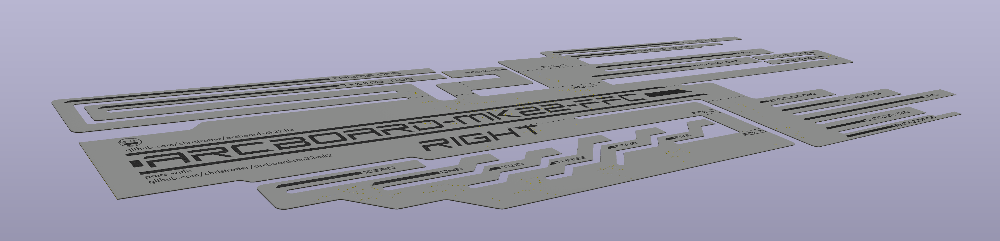
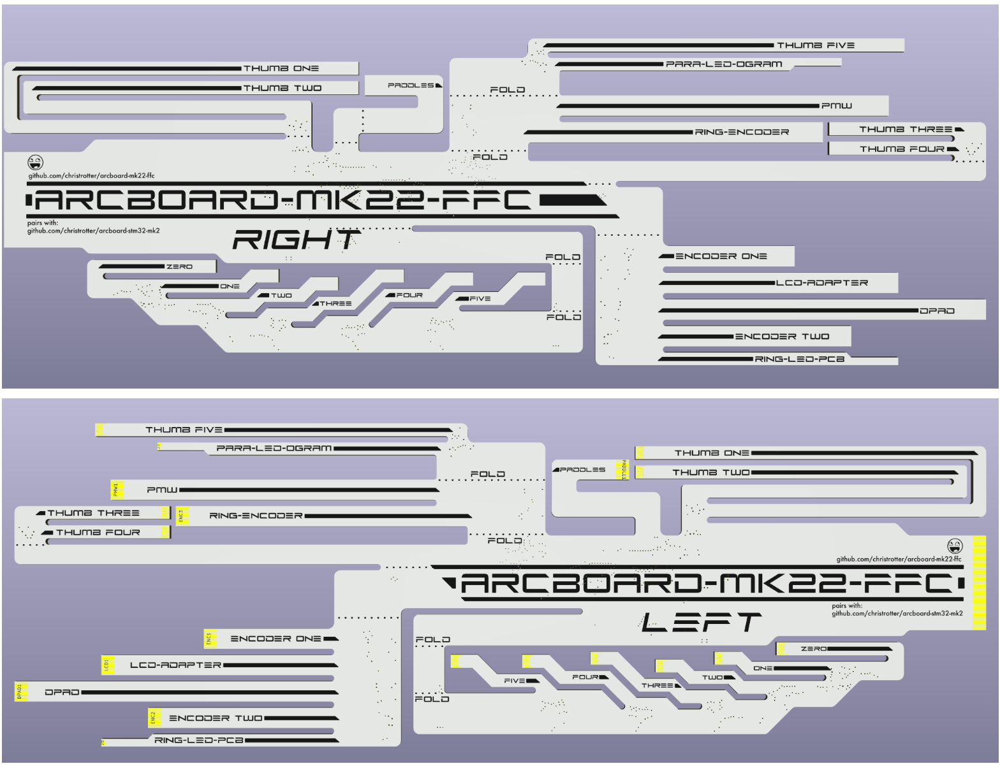
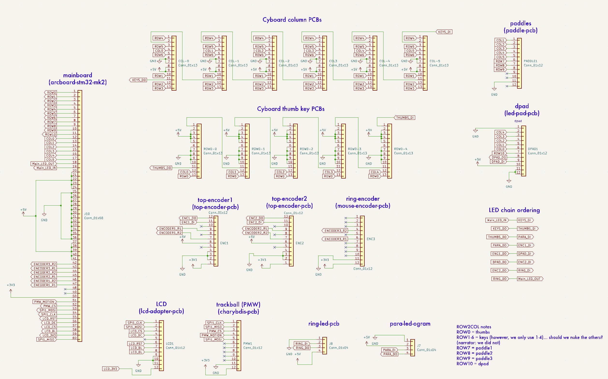
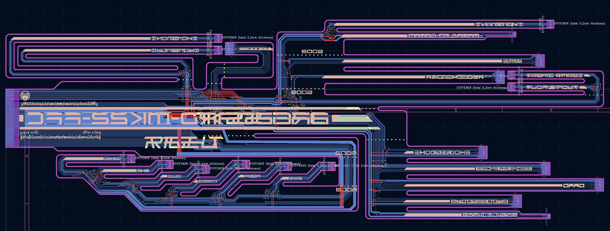

# arcboard-mk22-ffc

FFC wiring harness for the Arcboard mk22's [mainboard](https://github.com/christrotter/arcboard-stm32-mk2).  Hooks up a whole pile of keys, peripherals, and indicators with a single cable.  

The goal was to reduce manual soldering as much as possible while also reducing the number of FFC's coming off the mainboard.  [The old mainboard](https://github.com/christrotter/arcboard-stm32) had 10 FFCs coming off at all angles and it was a nightmare to install.

But what peripherals does this hook up?  Well...
- six [Cyboard column PCBs](https://cyboard.digital/products/dactyl-flex-pcbs)
- five [Cyboard thumb key PCBs](https://cyboard.digital/products/dactyl-flex-pcbs)
- [main LED indicator PCB](https://github.com/christrotter/para-led-ogram)
- [ring gear encoder indicator PCB](https://github.com/christrotter/ring-led-pcb)
- [an ST7789v2 LCD adapter PCB](https://github.com/christrotter/lcd-adapter-pcb)
- [two led-backlit EC10 encoders](https://github.com/christrotter/top-encoder-pcb)
- [one non-lit EC10 encoder](https://github.com/christrotter/mouse-encoder-pcb)
- [STM32 mainboard](https://github.com/christrotter/arcboard-stm32)
- [a dpad (5-way)](https://github.com/christrotter/led-pad)
- [three paddles (3x 5-way)](https://github.com/christrotter/multi-paddle-pcb)
- [PMW3360 to FFC](https://github.com/christrotter/charybdis-pmw-3360-sensor-pcb/tree/arcboarding) (*forked from* [Charybdis](https://github.com/Bastardkb/charybdis-pmw-3360-sensor-pcb))

### what if only one half has a trackball?
The theory is I tape or cap off the PMW endpoint on the left half.

## schematic

## PCB layout

## other
This is a FFC (flat flexible cable) or FPC (flexible printed circuit) - I am uncertain which term is right, so I go with FFC.
